<div align="center">



<br/><br/>


</div>

---

## `00 // ORIGIN_NODE`

Every system boots from a single line.

This was my first repository — created in 2021 while following the GitHub tutorial,
back when *"currently learning Python"* was the whole story. I never deleted it.
Instead, it became **Node 00**: the origin point every other system traces back to.

The commit history doesn't lie. That's the point.

---

## `01 // TRANSMISSIONS`

The same signal, sent through every layer of the stack — from database to bare metal.
Each file runs.

| # | File | Language | Layer |
|---|------|----------|-------|
| 01 | [`hello.py`](transmissions/hello.py) | Python | Where the learning started |
| 02 | [`hello.ts`](transmissions/hello.ts) | TypeScript | Types keep the signal clean |
| 03 | [`hello.js`](transmissions/hello.js) | JavaScript | The signal reaches the browser |
| 04 | [`hello.sql`](transmissions/hello.sql) | SQL | Every workflow ends up in a table |
| 05 | [`hello.sh`](transmissions/hello.sh) | Bash | Closest to the metal in one line |
| 06 | [`hello.c`](transmissions/hello.c) | C | The ancestor — every language above owes it rent |
| 07 | [`hello_gpio.py`](transmissions/hello_gpio.py) | Python + GPIO | The signal leaves the screen |
| 08 | [`hello.ino`](transmissions/hello.ino) | Arduino | Hello, World with a pulse |

```bash
# run the first transmission
$ python3 transmissions/hello.py
[NODE 00] Hello, World :: ONLINE
```

---

## `02 // WHY_KEEP_IT`

> The most interesting problems exist between disciplines —
> but every discipline starts with `print("Hello, World")`.

Transmissions 07 and 08 are the ones I care about most: the moment software
stops being text on a screen and starts blinking, moving, and measuring things
in the physical world. That thread — **code → hardware → medicine** — runs
through everything I build now.

---

<div align="center">

**[← BACK TO MAIN SYSTEM](https://github.com/jonam17)**

<sub>`NODE 00 // WHERE THE SIGNAL STARTED`</sub>

</div>
